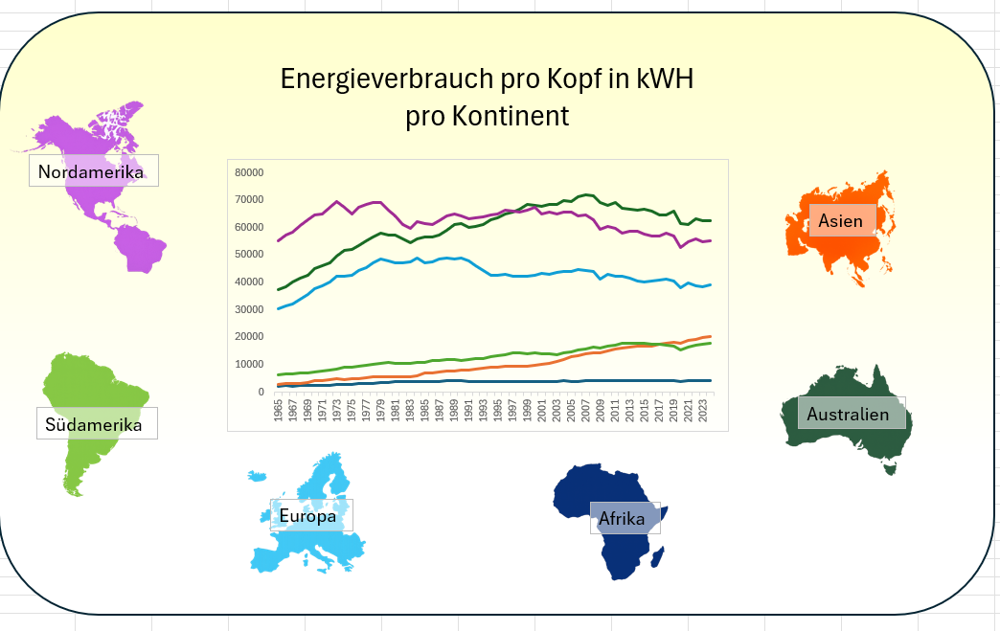

# Pro-Kopf-Energieverbrauch

Dieses Projekt entstand im Rahmen meiner Data-Science-Weiterbildung und beschäftigt sich mit der Analyse des weltweiten Energieverbrauchs pro Kopf.

## Ziel des Projekts

Ziel war es, die Daten in Excel aufzubereiten, zu analysieren und in mehreren miteinander verknüpften Dashboards übersichtlich darzustellen.

Dabei lag der Fokus auf der visuellen Exploration von Unterschieden und Entwicklungen im Energieverbrauch verschiedener Länder.

## Datenquelle

Die verwendeten Daten stammen von:

[Our World in Data](https://ourworldindata.org/grapher/energy-mix?source=total&metric=per_capita)

## Projektinhalt

* `energy_per_capita.xlsx` – Excel-Datei mit den zugrunde liegenden Daten und den verknüpften Dashboards
* `energy_per_capita/` – PNG-Exporte der Dashboards als Vorschau und Backup

Die eigentliche Analyse ist in der Excel-Datei enthalten. Dort sind die Dashboards miteinander verknüpft.

## Technologien

* Microsoft Excel

## Hinweis

Die PNG-Dateien dienen lediglich als statische Vorschau der Dashboards. Für die vollständige Darstellung und Navigation zwischen den einzelnen Ansichten sollte die Excel-Datei geöffnet werden.
